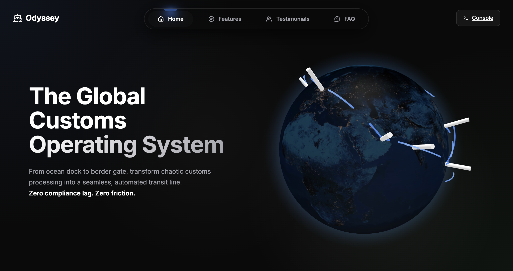
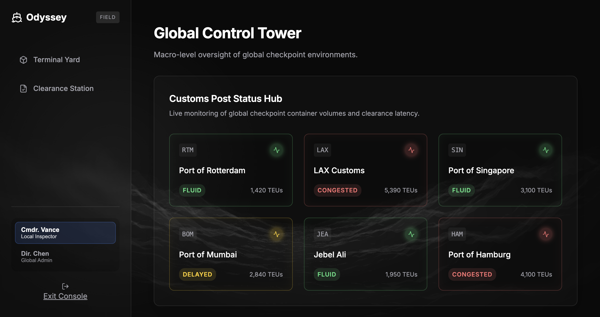
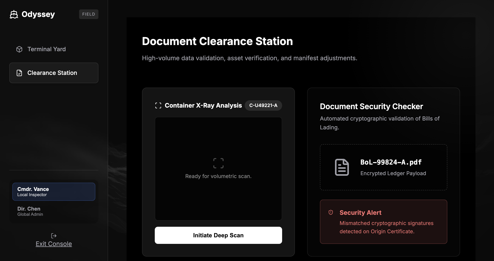

# ⚓️ Odyssey: Global Customs Operating System

**🟢 Live Demo:** [https://odyssey-indol-one.vercel.app/](https://odyssey-indol-one.vercel.app/)

Odyssey is a high-fidelity, role-based B2B SaaS prototype designed to modernize international border management. It simulates a complete, end-to-end customs clearance workflow, offering distinct dashboards for both local port inspectors and global logistics administrators.

## 📸 Screenshots

### The Interactive Landing Page


### The Role Switcher & Clearance Station


### Admin Threat Map & Route Optimizer


## 💻 Tech Stack & Dependencies

Odyssey is built as a highly performant, client-side Single Page Application (SPA) utilizing a modern 2026 rendering stack.

### Core Framework
- **React 19 & Vite 8:** Lightning-fast component rendering and hot-module replacement via the Vite bundler.
- **React Router DOM (v7):** Handles strict client-side routing between the marketing landing page and the protected Console application.

### Visuals & 3D Rendering
- **Three.js & React-Globe.gl:** Powers the massively interactive 3D WebGL trade route globe in the hero section, featuring live-rendered arcs and glowing port nodes.
- **Framer Motion:** Utilized for buttery-smooth micro-animations, component mounting transitions, and interactive UI spring physics (e.g., the Tubelight Navigation bar).
- **Lucide React:** A clean, consistent SVG iconography system used extensively across the Console dashboards.
- **Custom GLSL WebGL Shaders:** A mathematically driven, raw GLSL shader (`glsl-hills.jsx`) runs at the root level (`App.jsx`), generating the persistent, flowing digital wave background that persists across all routes.

## 🏗 Architectural Decisions & React Hooks

### 1. Role-Based Access Control (RBAC) Architecture
The Console is governed by a strict RBAC state machine implemented inside `ConsoleLayout.jsx`. 
- **State Management:** `useState` is used to track the `activeRole` (`'inspector'` vs `'admin'`).
- **Dynamic Routing:** We use `react-router-dom`'s `useLocation` to track active paths and `useNavigate` to instantly redirect users if they switch to a role that does not have security clearance for their current view.
- **Array Filtering:** The sidebar dynamically rebuilds itself by mapping over a hardcoded array of `navItems`, filtering out routes where `navItem.roles` does not include the `activeRole`.

### 2. State & Data Tracking (Hooks Used)
- **`useState`:** Heavily utilized across the console. 
  - *ManifestWorkspace:* Manages the `inventory` array (for the Tax Cost Sorter) and the `history` array (powering the Event-Sourcing Audit Trail and Undo functionality).
  - *XRayScanner:* Manages the `scanning` and `scanned` boolean states to trigger the CSS volumetric scan animations.
- **`useEffect`:** 
  - *Global Mouse Glow:* Bound to the `App.jsx` root. A `useEffect` hook attaches an event listener to `window.mousemove`, continuously updating `--mouse-x` and `--mouse-y` CSS variables on the `:root`. This powers the ambient radial glow that follows the user's cursor across the entire application.

### 3. CSS Architecture
- **CSS Custom Properties (Variables):** The entire app is themed using CSS variables (e.g., `var(--bg)`, `var(--primary)`).
- **Alpha Masking:** Advanced `mask-image` linear gradients are used (like in the vertical CTA Marquee) to smoothly fade text into the background without painting solid gradient blocks over the transparent 3D waves.
- **Glassmorphism:** `backdrop-filter: blur()` is utilized on the navigation and sidebar to create a premium, frosted-glass depth effect.

## 🚀 The Feature Set

### The Local Inspector Workflow (Clearance Station & Terminal Yard)
- **AI Tariff Classifier:** Instantly lookup and organize international HS tax codes.
- **Manifest Audit Trail:** A version-controlled ledger tracking all edits to shipping manifests with safe undo capabilities.
- **Smart FIFO Queue:** Sequential container management lining up checks based on arrival.
- **Document Security Checker:** Cryptographic fraud detection cross-examining Bills of Lading against a secure registry.
- **Tax Cost Sorter:** In-memory algorithm that instantly ranks cargo items based on tax revenue yielded.
- **Inspector Workload Planner:** Dynamic staff allocation managing port congestion across terminal lanes.
- **Container X-Ray Analysis:** A volumetric deep-scan simulation detecting contraband and density anomalies in physical cargo.

### The Global Admin Workflow (Control Tower)
- **Customs Post Status Hub:** Real-time global congestion monitoring across massive ports (LAX, Rotterdam, Singapore).
- **Quickest Clearance Route:** AI pathfinding engine calculating alternative transit routes to bypass congested checkpoints.
- **Global Sanctions Ledger:** A cryptographic audit log tracking international embargoes, blocked corporate entities, and active global threat levels.

## 📁 Deep Folder Structure

```text
odyssey/
├── index.html                 # Main HTML entry point
├── package.json               # Dependencies (React, Three, Framer Motion, etc.)
├── vite.config.js             # Vite bundler configuration
├── src/
│   ├── main.jsx               # React DOM rendering root
│   ├── App.jsx                # Router, Root GLSL Background, Mouse Glow listener
│   ├── App.css                # Base resets
│   ├── index.css              # Master Design System (Vars, Animations, Layouts)
│   │
│   ├── assets/                # Static files (SVGs, imagery)
│   │
│   ├── data/
│   │   └── consoleData.js     # Mock data structures for the RBAC dashboards
│   │
│   ├── pages/                 # Top-Level Route Controllers
│   │   ├── LandingPage.jsx    # Assembles the marketing sections
│   │   └── console/           # The SaaS Application Views
│   │       ├── ClearanceStation.jsx  # Inspector Workflow UI
│   │       ├── ControlTower.jsx      # Admin Workflow UI
│   │       ├── SanctionsLedger.jsx   # Admin Threat Map UI
│   │       └── TerminalYard.jsx      # Port Logistics UI
│   │
│   └── components/            # Modular React Components
│       ├── layout/
│       │   ├── ConsoleLayout.jsx     # Handles the RBAC Role Switcher & Sidebar
│       │   ├── SiteHeader.jsx        # Landing page navigation wrapper
│       │   ├── SiteFooter.jsx        # Global footer
│       │   └── BrandMark.jsx         # Centralized logo component
│       │
│       ├── sections/                 # Landing Page Marketing Blocks
│       │   ├── LandingHero.jsx       # 3D Globe Split-Hero
│       │   ├── FeaturesSection.jsx   # Value propositions
│       │   ├── TrustedPortsSection.jsx # Infinite marquee
│       │   └── FAQSection.jsx        # Accordion questions
│       │
│       ├── console/                  # Specific SaaS Tools
│       │   ├── ManifestWorkspace.jsx # Tax Sorter & Audit Trail
│       │   ├── XRayScanner.jsx       # Volumetric simulation
│       │   ├── SecurityChecker.jsx   # Bill of Lading verification
│       │   ├── TaxCodeFinder.jsx     # HS Code search
│       │   ├── RouteFinder.jsx       # AI Pathfinding
│       │   ├── PostStatusHub.jsx     # Global port congestion
│       │   ├── InspectionQueue.jsx   # Smart FIFO UI
│       │   └── WorkloadPlanner.jsx   # Dynamic staff allocation
│       │
│       └── ui/                       # Reusable UI Primitives & Aceternity Components
│           ├── hero-globe.jsx        # Three.js / react-globe.gl implementation
│           ├── glsl-hills.jsx        # Custom WebGL Shader background
│           ├── tubelight-navbar.jsx  # Framer Motion animated navigation
│           ├── cta-with-text-marquee.jsx # CSS Alpha-masked marquee
│           └── logos3.jsx            # Animated logo scroller
```

## 🛠 Setup Instructions & Running Locally

Another developer should be able to spin this up in less than 2 minutes without any external help.

**Prerequisites:**
- Make sure you have [Node.js](https://nodejs.org/) installed (v18 or higher recommended).
- Git installed on your machine.

**Step-by-step Execution:**
1. **Clone the repository:**
   ```bash
   git clone https://github.com/abdealimak/reactjs-project.git
   ```
2. **Navigate into the project directory:**
   ```bash
   cd odyssey
   ```
3. **Install all dependencies:**
   ```bash
   npm install
   ```
   *(This will automatically download React, Vite, Three.js, Framer Motion, and all other required packages).*
4. **Start the Vite development server:**
   ```bash
   npm run dev
   ```
5. **View the app:** Open your browser and go to the local port provided in your terminal (usually `http://localhost:5173`).

## 🔮 What's Remaining (Future Scope)

Currently, Odyssey is a high-fidelity frontend prototype running entirely on client-side state and mock data arrays. To make it a fully production-ready application, the following backend architecture must be implemented:

1. **Backend Database Architecture:** Replace the `consoleData.js` mock arrays with a real relational database (like PostgreSQL) to permanently persist manifest edits, store the audit log, and save X-ray scan reports.
2. **Authentication & Security:** Implement a real authentication provider (like Auth0 or NextAuth). The current interactive "Role Switcher" must be replaced with strict server-side validation that pulls user permissions directly from a secure JWT token.
3. **Live Maritime API Integrations:** Hook the "AI Tariff Classifier" and the "Route Finder" directly into real-world supply chain and customs APIs (such as the WCO API for live HS code validation) instead of utilizing local mock pathfinding algorithms.
